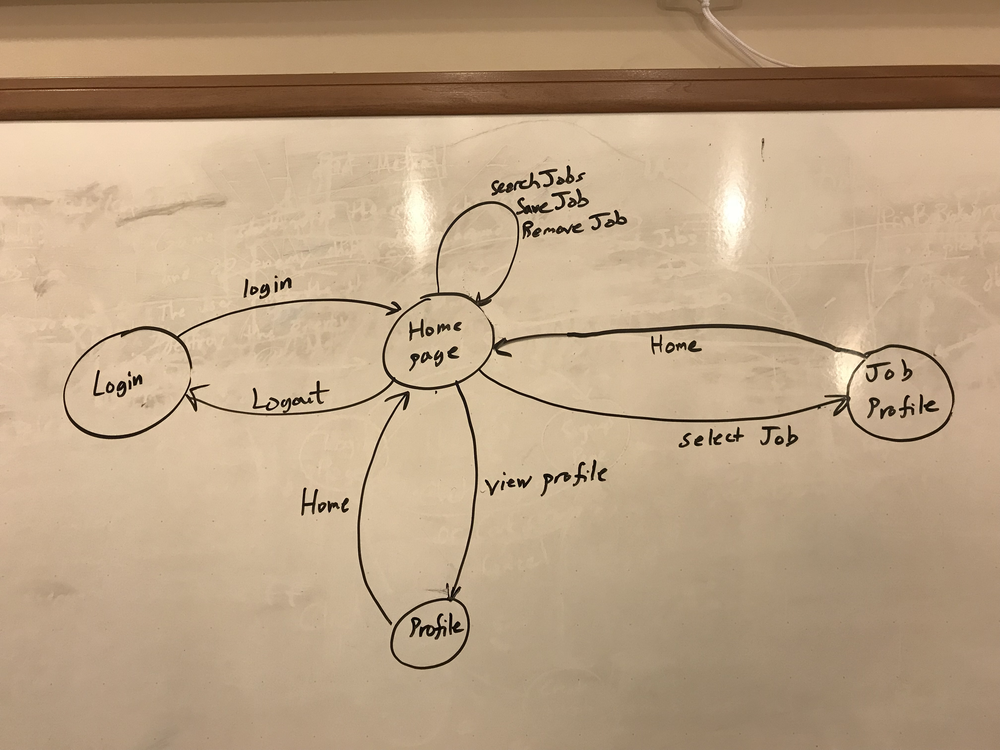
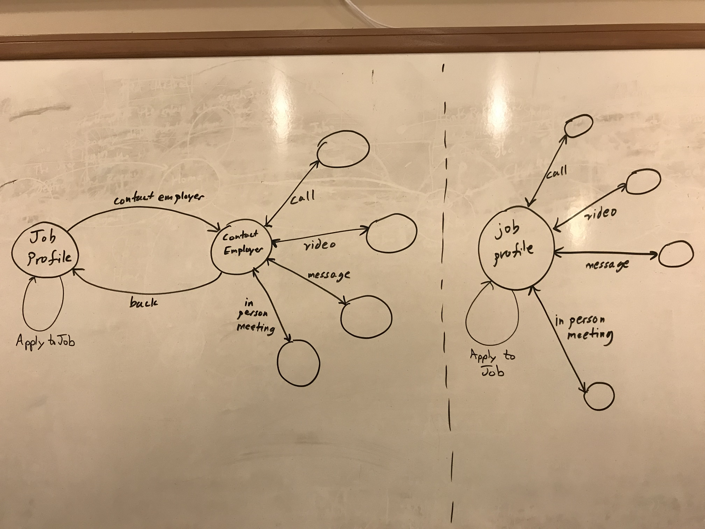
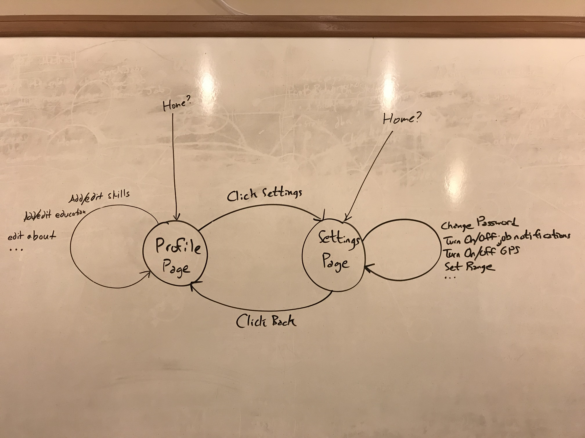
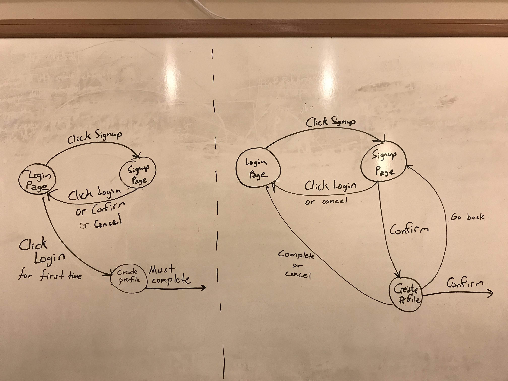

A deployed version of this app can be found [here](http://waldojobs.s3-website-us-east-1.amazonaws.com)
# App Overview

Features included in this application:

* User Creation
  * Welcome page.
  * Sign-up page.
  * Sign-in page.
  * Profile page.

* Search
  * Recommended jobs page.
  * Search page.

* Jobs
  * Jobs page.
  * Job details page
  * Chat page.

### User Creation

The user creation process involved utilizing a preexisting module called ember-cli-gatekeeper, which handles all authentication.

Creating a base user with gatekeeper within the application is functional, however the view for adding user profile information is under development. The profile is currently in a mock state.

### Search

The recommended jobs page is functional but needs to be updated to query by location, user experience, and user education.

The search page, similar to the recommended jobs page, queries for all existing jobs. This needs to be updated to query by the search string and location provided.

### Jobs

The jobs page is functional but currently shows all existing jobs, this needs to change to show only jobs on the users favorites list.

When viewing jobs details you have the option of chatting with the person who posted the job, this will redirect you to the chat page.

Once you are on the chat page you can begin a conversation. Users can send messages, but there is not currently an employee portal in which an employee can send a message to a user. This process is only partially implemented due to time constraints.

## Future work
[Here](https://github.com/CS450-ECE461/fall2017-team4-mobile/milestone/2) are all of our tickets to complete in the future

## Login credentials (Or you can make your own user on the sign-up page)
Username: sherryj@gmail.com
Password: test

## GUI Transition Diagrams
Home page:

Job Profile:

User Profile:

Sign in options:

